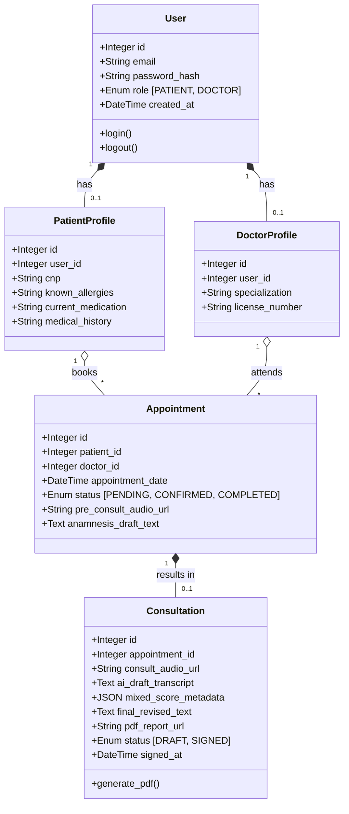

```mermaid
classDiagram
    direction TB

    class User {
        +Integer id
        +String email
        +String password_hash
        +Enum role [PATIENT, DOCTOR]
        +DateTime created_at
        +login()
        +logout()
    }

    class PatientProfile {
        +Integer id
        +Integer user_id
        +String cnp
        +String known_allergies
        +String current_medication
        +String medical_history
    }

    class DoctorProfile {
        +Integer id
        +Integer user_id
        +String specialization
        +String license_number
    }

    class Appointment {
        +Integer id
        +Integer patient_id
        +Integer doctor_id
        +DateTime appointment_date
        +Enum status [PENDING, CONFIRMED, COMPLETED]
        +String pre_consult_audio_url
        +Text anamnesis_draft_text
    }

    class Consultation {
        +Integer id
        +Integer appointment_id
        +String consult_audio_url
        +Text ai_draft_transcript
        +JSON mixed_score_metadata
        +Text final_revised_text
        +String pdf_report_url
        +Enum status [DRAFT, SIGNED]
        +DateTime signed_at
        +generate_pdf()
    }

    %% Relațiile dintre clase
    User "1" *-- "0..1" PatientProfile : has
    User "1" *-- "0..1" DoctorProfile : has
    
    PatientProfile "1" o-- "*" Appointment : books
    DoctorProfile "1" o-- "*" Appointment : attends
    
    Appointment "1" *-- "0..1" Consultation : results in
```