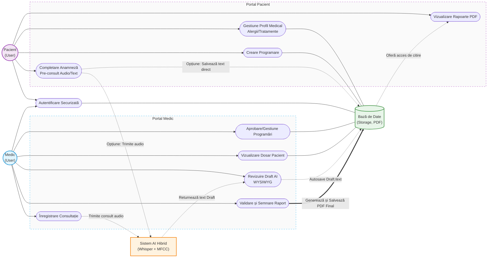

```mermaid
flowchart LR
    %% Definirea Actorilor
    Pacient(("Pacient \n (User)"))
    Medic(("Medic \n (User)"))
    AI["Sistem AI Hibrid\n (Whisper + MFCC)"]
    DB[("Bază de Date \n (Storage, PDF)")]

    %% Cazuri de utilizare - Pacient
    subgraph Portal_Pacient [Portal Pacient]
        P1([Gestiune Profil Medical \n Alergii/Tratamente])
        P2([Creare Programare])
        P3([Completare Anamneză \n Pre-consult Audio/Text])
        P4([Vizualizare Rapoarte PDF])
    end

    %% Cazuri de utilizare - Medic
    subgraph Portal_Medic [Portal Medic]
        M1([Aprobare/Gestiune Programări])
        M2([Vizualizare Dosar Pacient])
        M3([Înregistrare Consultație])
        M4([Revizuire Draft AI \n WYSIWYG])
        M5([Validare și Semnare Raport])
    end
    
    %% Cazuri comune
    UC_Auth([Autentificare Securizată])

    %% Conexiuni Pacient
    Pacient --> UC_Auth
    Pacient --> P1
    Pacient --> P2
    Pacient --> P3
    Pacient --> P4

    %% Conexiuni Medic
    Medic --> UC_Auth
    Medic --> M1
    Medic --> M2
    Medic --> M3
    Medic --> M4
    Medic --> M5

    %% Conexiuni AI
    P3 -.->|Opțiune: Trimite audio| AI
    M3 -.->|Trimite consult audio| AI
    AI -.->|Returnează text Draft| M4

    %% Conexiuni Bază de Date & Salvare PDF
    UC_Auth --- DB
    P1 --- DB
    P2 --- DB
    M1 --- DB
    M2 --- DB
    P3 -.->|Opțiune: Salvează text direct| DB
    M4 -.->|Autosave Draft text| DB
    M5 ==>|Generează și Salvează PDF Final| DB
    DB -.->|Oferă acces de citire| P4

    %% Stilizare
    style Pacient fill:#f3e5f5,stroke:#8e24aa,stroke-width:2px
    style Medic fill:#e1f5fe,stroke:#0288d1,stroke-width:2px
    style AI fill:#fff3e0,stroke:#f57c00,stroke-width:2px
    style DB fill:#e8f5e9,stroke:#388e3c,stroke-width:2px
    style Portal_Pacient fill:#fafafa,stroke:#ab47bc,stroke-width:1px,stroke-dasharray: 5 5
    style Portal_Medic fill:#fafafa,stroke:#29b6f6,stroke-width:1px,stroke-dasharray: 5 5
```