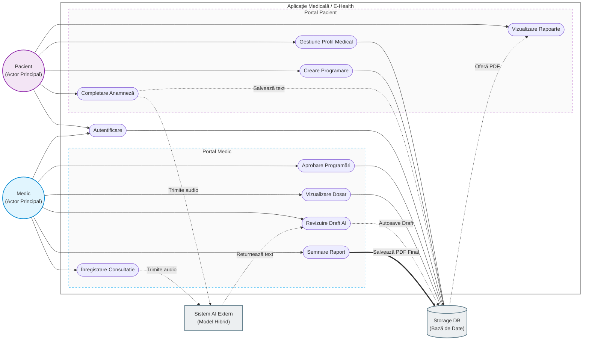

```mermaid
flowchart LR
    %% Definirea Actorilor Principali (Stânga)
    Pacient(("Pacient \n (Actor Principal)"))
    Medic(("Medic \n (Actor Principal)"))

    %% Sistemul nostru principal (Limita)
    subgraph Sistem_Medical [Aplicație Medicală / E-Health]
        
        subgraph Portal_Pacient [Portal Pacient]
            P1([Gestiune Profil Medical])
            P2([Creare Programare])
            P3([Completare Anamneză])
            P4([Vizualizare Rapoarte])
        end

        subgraph Portal_Medic [Portal Medic]
            M1([Aprobare Programări])
            M2([Vizualizare Dosar])
            M3([Înregistrare Consultație])
            M4([Revizuire Draft AI])
            M5([Semnare Raport])
        end
        
        UC_Auth([Autentificare])
    end

    %% Definirea Actorilor Secundari (Sisteme, în dreapta)
    AI["Sistem AI Extern\n (Model Hibrid)"]
    DB[("Storage DB\n (Bază de Date)")]

    %% Conexiuni Pacient
    Pacient --> UC_Auth
    Pacient --> P1
    Pacient --> P2
    Pacient --> P3
    Pacient --> P4

    %% Conexiuni Medic
    Medic --> UC_Auth
    Medic --> M1
    Medic --> M2
    Medic --> M3
    Medic --> M4
    Medic --> M5

    %% Conexiuni Aplicație -> Actori Secundari (AI și DB)
    P3 -.->|Trimite audio| AI
    M3 -.->|Trimite audio| AI
    AI -.->|Returnează text| M4

    UC_Auth --- DB
    P1 --- DB
    P2 --- DB
    M1 --- DB
    M2 --- DB
    P3 -.->|Salvează text| DB
    M4 -.->|Autosave Draft| DB
    M5 ==>|Salvează PDF Final| DB
    DB -.->|Oferă PDF| P4

    %% Stilizare
    style Pacient fill:#f3e5f5,stroke:#8e24aa,stroke-width:2px
    style Medic fill:#e1f5fe,stroke:#0288d1,stroke-width:2px
    style AI fill:#eceff1,stroke:#607d8b,stroke-width:2px
    style DB fill:#eceff1,stroke:#607d8b,stroke-width:2px
    style Sistem_Medical fill:#ffffff,stroke:#9e9e9e,stroke-width:2px
    style Portal_Pacient fill:#fafafa,stroke:#ab47bc,stroke-width:1px,stroke-dasharray: 5 5
    style Portal_Medic fill:#fafafa,stroke:#29b6f6,stroke-width:1px,stroke-dasharray: 5 5
```