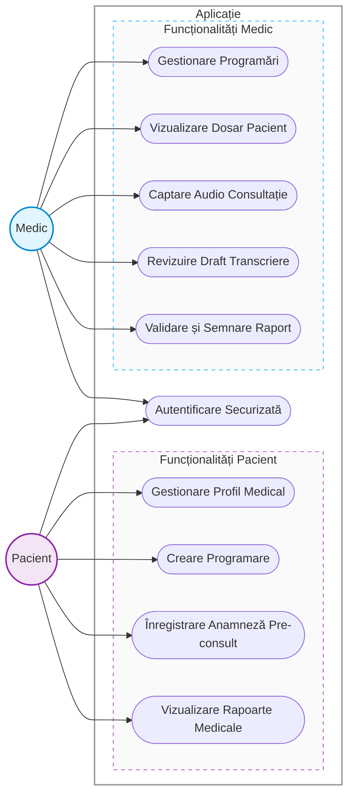

```mermaid
flowchart LR
    %% Definirea Actorilor (Doar Utilizatori Umani)
    Pacient(("Pacient"))
    Medic(("Medic"))

    %% Limita Sistemului (Aplicația ca o Cutie Neagră)
    subgraph Platforma_EHealth [Aplicație]
        
        UC_Auth([Autentificare Securizată])

        subgraph Portal_Pacient [Funcționalități Pacient]
            P1([Gestionare Profil Medical])
            P2([Creare Programare])
            P3([Înregistrare Anamneză Pre-consult])
            P4([Vizualizare Rapoarte Medicale])
        end

        subgraph Portal_Medic [Funcționalități Medic]
            M1([Gestionare Programări])
            M2([Vizualizare Dosar Pacient])
            M3([Captare Audio Consultație])
            M4([Revizuire Draft Transcriere])
            M5([Validare și Semnare Raport])
        end
    end

    %% Conexiuni Pacient
    Pacient --> UC_Auth
    Pacient --> P1
    Pacient --> P2
    Pacient --> P3
    Pacient --> P4

    %% Conexiuni Medic
    Medic --> UC_Auth
    Medic --> M1
    Medic --> M2
    Medic --> M3
    Medic --> M4
    Medic --> M5

    %% Stilizare
    style Pacient fill:#f3e5f5,stroke:#8e24aa,stroke-width:2px
    style Medic fill:#e1f5fe,stroke:#0288d1,stroke-width:2px
    style Platforma_EHealth fill:#ffffff,stroke:#9e9e9e,stroke-width:2px
    style Portal_Pacient fill:#fafafa,stroke:#ab47bc,stroke-width:1px,stroke-dasharray: 5 5
    style Portal_Medic fill:#fafafa,stroke:#29b6f6,stroke-width:1px,stroke-dasharray: 5 5
```