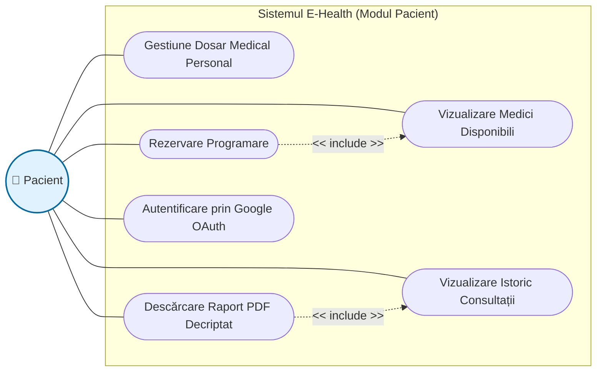
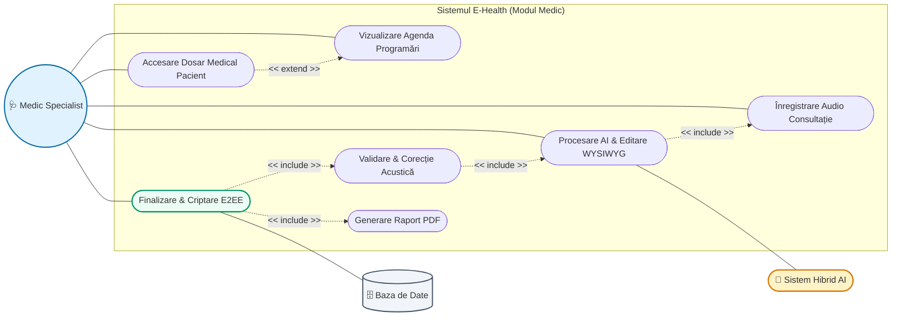
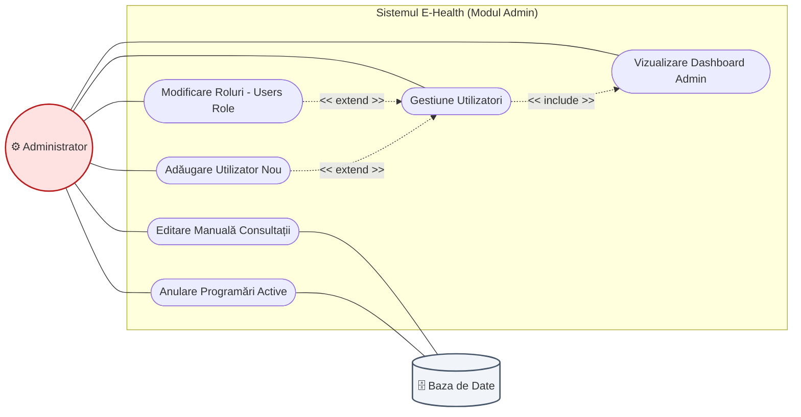
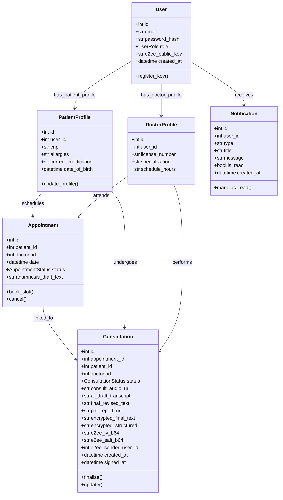

# Diagramele Platformei E-Health în format Mermaid

Acest document conține codul sursă **Mermaid** pentru toate diagramele cazurilor de utilizare (împărțite pe cele trei roluri: Pacient, Medic, Administrator) și pentru diagrama de clase ORM. 

Poți vizualiza aceste diagrame direct în orice editor de Markdown compatibil (cum ar fi VS Code cu extensia Markdown Preview Mermaid, GitHub, sau direct pe [Mermaid Live Editor](https://mermaid.live) pentru a le exporta ca imagini PNG/SVG de înaltă rezoluție pentru lucrarea ta).

---

## 1. Diagrama Cazurilor de Utilizare — Modulul Pacient

Această diagramă ilustrează interacțiunile pacientului cu platforma E-Health, evidențiind fluxul de programări și înregistrarea simptomelor pre-consult.

---

## 2. Diagrama Cazurilor de Utilizare — Modulul Medic

Această diagramă evidențiază fluxurile clinice ale medicului, în special înregistrarea consultației, corecția cu Scorul Mixt (HITL) și finalizarea cu criptare E2EE.

---

## 3. Diagrama Cazurilor de Utilizare — Modulul Administrator

Această diagramă prezintă opțiunile de mentenanță tehnică, gestiunea utilizatorilor, alocarea rolurilor de sistem și editarea administrativă.

---

## 4. Diagrama de Clase (Modelul de Date ORM SQLAlchemy)

Această diagramă reflectă structura de clase Python asociată tabelelor din PostgreSQL, ilustrând atributele detaliate, tipurile de date și multiplicitățile relațiilor (1:1, 1:N).

